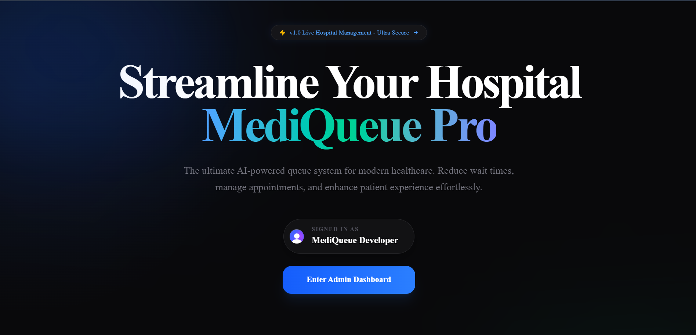
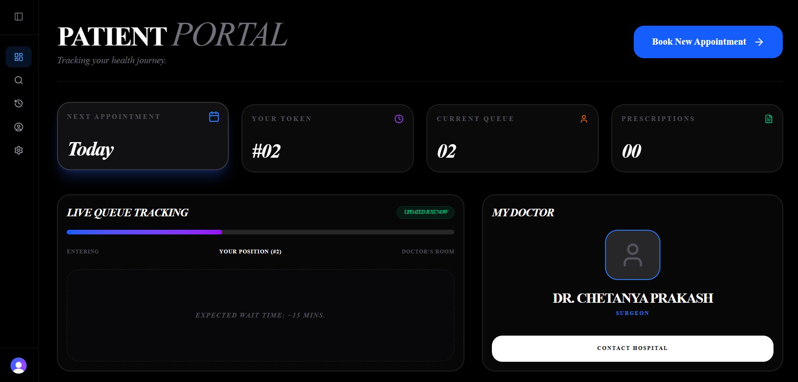
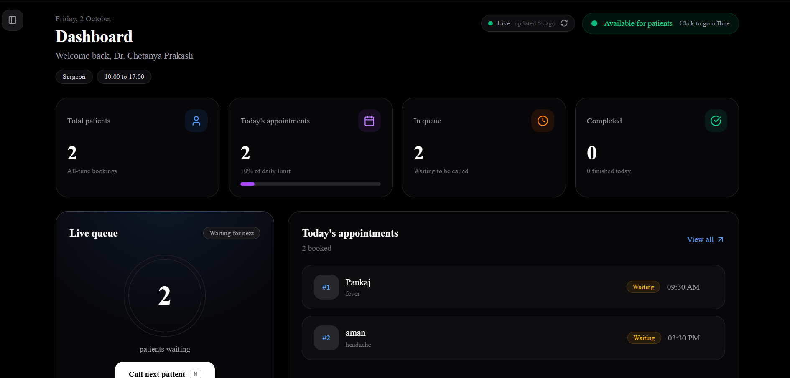
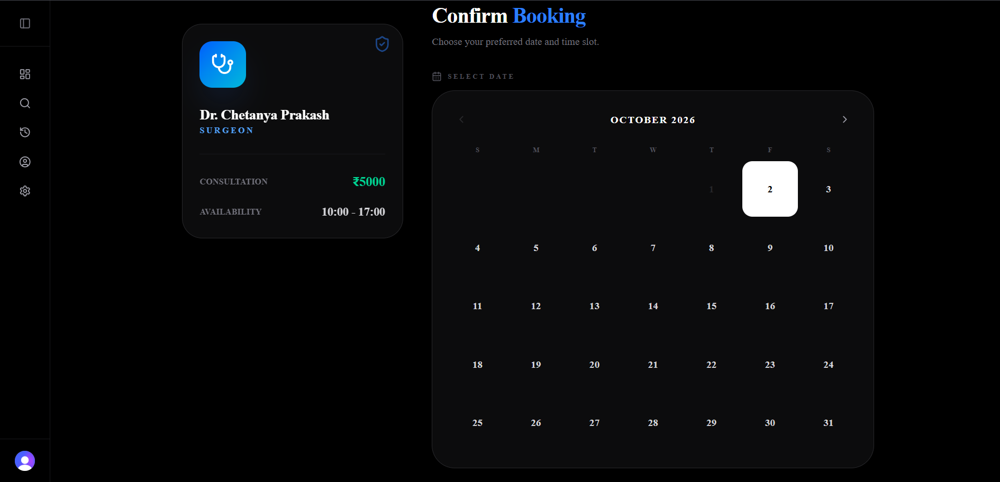
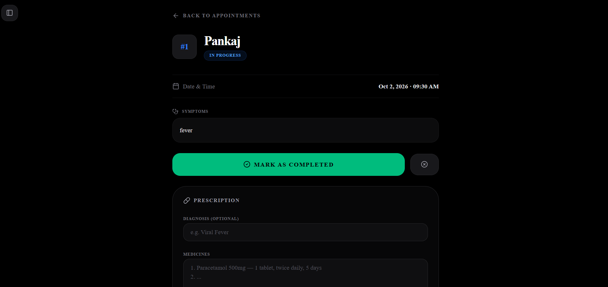
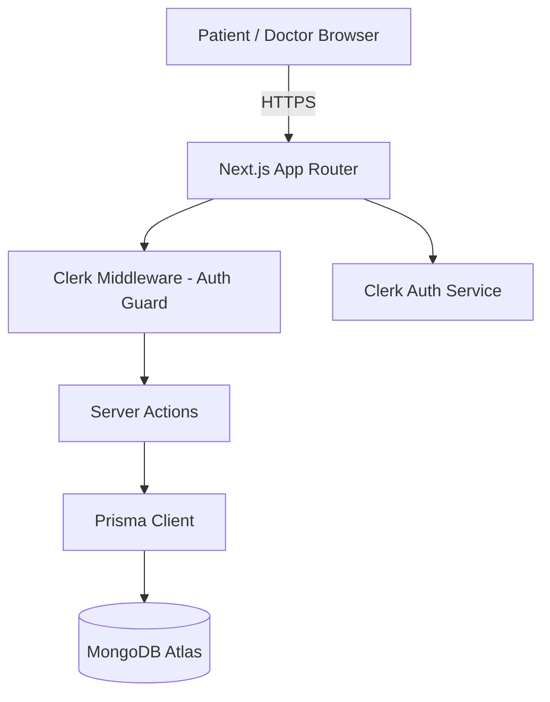
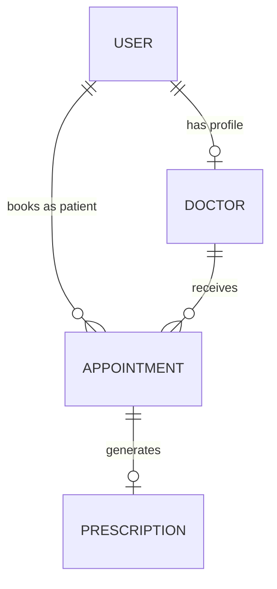

<div align="center">

# 🏥 MediQueue Pro

**A modern hospital / clinic queue and appointment management system**

Patients book appointments, get a live token number, and track their place in the queue — while doctors manage their schedule, availability, and write digital prescriptions.

[](https://nextjs.org/)
[](https://react.dev/)
[](https://www.typescriptlang.org/)
[](https://www.prisma.io/)
[](https://www.mongodb.com/)
[](https://clerk.com/)
[](https://tailwindcss.com/)

</div>

---

## 📑 Table of Contents

- [Features](#-features)
- [Screenshots](#-screenshots)
- [Tech Stack](#-tech-stack)
- [Architecture](#-architecture)
- [Project Structure](#-project-structure)
- [Data Models](#-data-models)
- [Getting Started](#-getting-started)
- [Available Scripts](#-available-scripts)
- [Deployment](#-deployment)
- [Roadmap](#-roadmap--ideas-for-improvement)
- [Contributing](#-contributing)
- [License](#-license)

---

## ✨ Features

- 🔐 **Secure authentication** with Clerk (sign up, sign in, session/route protection via middleware)
- 👥 **Role-based dashboards** — separate flows for `PATIENT`, `DOCTOR`, and `ADMIN`
- 📅 **Appointment booking** with live token numbers and queue status (`WAITING → IN_PROGRESS → COMPLETED / CANCELLED`)
- 🔎 **Find doctors** by specialization, availability, and consultation fees
- 🩺 **Doctor dashboard** — manage working hours, daily patient limit, availability toggle, and appointment queue
- 📋 **Digital prescriptions** — diagnosis, medicines, and notes tied 1:1 with each appointment
- 🕘 **Patient history** — view past appointments and cancel upcoming bookings
- 🌗 **Dark/light theme** support via `next-themes`
- 🎨 **Polished UI** — Tailwind CSS v4, shadcn/ui components, and Framer Motion animations

---

## 📸 Screenshots

> Screenshots will be added here. To add your own: create a `screenshots/` folder in the project root, drop your PNG/JPG files in it, and replace the paths below.

<div align="center">

| Landing Page | Patient Dashboard |
|---|---|
|  |  |

| Doctor Dashboard | Book Appointment |
|---|---|
|  |  |

| Appointment History | Digital Prescription |
|---|---|
|  |  |

</div>

<details>
<summary>📝 How to add real screenshots (click to expand)</summary>

1. Run the app locally (`npm run dev`) and open it in your browser.
2. Take screenshots of each page (landing page, patient dashboard, doctor dashboard, booking flow, history, prescription view, etc.).
3. Create a `screenshots/` folder in the project root and save the images there with matching names (`landing.png`, `patient-dashboard.png`, etc.), or update the paths above to match your file names.
4. Commit and push:
   ```bash
   git add screenshots/ README.md
   git commit -m "Add screenshots"
   git push
   ```
5. The images will render automatically on your GitHub repo page.

</details>

---

## 🧱 Tech Stack

| Layer | Technology |
|---|---|
| Framework | [Next.js 16](https://nextjs.org/) (App Router) + React 19 |
| Language | TypeScript |
| Auth | [Clerk](https://clerk.com/) |
| Database | MongoDB via [Prisma ORM](https://www.prisma.io/) |
| Styling | Tailwind CSS v4, shadcn/ui, `tailwind-merge`, `tw-animate-css` |
| Animation | Framer Motion |
| Icons | Lucide React |
| Notifications | Sonner |

---

## 🏗 Architecture



- **Clerk middleware** protects all routes except the landing page and onboarding.
- **Server Actions** (`src/actions/*`) handle all reads/writes — no separate REST/GraphQL API layer needed.
- **Prisma** talks to a MongoDB database using the schema in `prisma/schema.prisma`.

---

## 📂 Project Structure

```
src/
├── actions/              # Server actions (appointment, doctor, user, prescription, dashboard)
├── app/
│   ├── dashboard/
│   │   ├── doctor/       # Doctor dashboard: appointments, profile, settings, onboarding
│   │   └── patient/      # Patient dashboard: book, history, find-doctors, profile, settings
│   ├── layout.tsx
│   └── page.tsx          # Landing page
├── components/
│   ├── ui/                # shadcn/ui components
│   ├── theme-provider.tsx
│   └── theme-toggle.tsx
├── lib/                   # db client, utils
└── middleware.ts          # Clerk route protection

prisma/
├── schema.prisma          # User, Doctor, Appointment, Prescription models
└── seed.js
```

---

## 🗄️ Data Models

- **User** — Clerk-linked account with a `role` (`PATIENT` / `DOCTOR` / `ADMIN`)
- **Doctor** — specialization, fees, availability, working hours, and max patients/day
- **Appointment** — links a patient and doctor, with a token number and status
- **Prescription** — diagnosis, medicines, and notes, tied to one appointment



---

## 🚀 Getting Started

### Prerequisites

- Node.js 18+
- A MongoDB database (e.g. [MongoDB Atlas](https://www.mongodb.com/atlas))
- A [Clerk](https://clerk.com/) account for authentication keys

### 1. Clone the repository

```bash
git clone https://github.com/<your-username>/<your-repo>.git
cd <your-repo>
```

### 2. Install dependencies

```bash
npm install
```

### 3. Configure environment variables

Create a `.env` file in the root directory:

```env
DATABASE_URL="your-mongodb-connection-string"
NEXT_PUBLIC_CLERK_PUBLISHABLE_KEY="your-clerk-publishable-key"
CLERK_SECRET_KEY="your-clerk-secret-key"
```

> ⚠️ Never commit your `.env` file. It's already excluded via `.gitignore`.

### 4. Generate Prisma client & push schema

```bash
npx prisma generate
npx prisma db push
```

Optionally seed the database:

```bash
node prisma/seed.js
```

### 5. Run the development server

```bash
npm run dev
```

Open [http://localhost:3000](http://localhost:3000) to view the app.

---

## 📜 Available Scripts

| Command | Description |
|---|---|
| `npm run dev` | Start the development server |
| `npm run build` | Build for production |
| `npm run start` | Start the production server |
| `npm run lint` | Run ESLint |

---

## ☁️ Deployment

This project is ready to deploy on [Vercel](https://vercel.com/):

1. Push this repository to GitHub.
2. Import the repo on [vercel.com/new](https://vercel.com/new).
3. Add the same environment variables (`DATABASE_URL`, `NEXT_PUBLIC_CLERK_PUBLISHABLE_KEY`, `CLERK_SECRET_KEY`) in the Vercel project settings.
4. Deploy 🎉

> Make sure your MongoDB Atlas cluster allows connections from anywhere (`0.0.0.0/0`) or whitelists Vercel's IPs, and that your Clerk instance is configured with the correct production/preview domain(s).

---

## 🛣 Roadmap / Ideas for Improvement

- [ ] Real-time queue updates (WebSockets / Server-Sent Events)
- [ ] SMS/email notifications for token turn
- [ ] Admin panel for managing doctors and hospital-wide analytics
- [ ] Payment integration for consultation fees
- [ ] Multi-clinic / multi-branch support

---

## 🤝 Contributing

Contributions, issues, and feature requests are welcome!

1. Fork the repository
2. Create your feature branch (`git checkout -b feature/amazing-feature`)
3. Commit your changes (`git commit -m 'Add some amazing feature'`)
4. Push to the branch (`git push origin feature/amazing-feature`)
5. Open a Pull Request

---

## 📄 License

This project is currently unlicensed. Add a license (e.g. MIT) if you plan to open-source it.