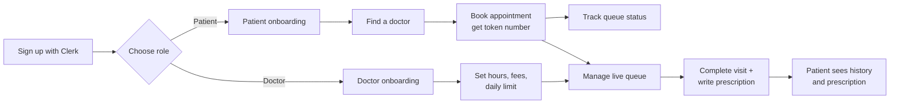
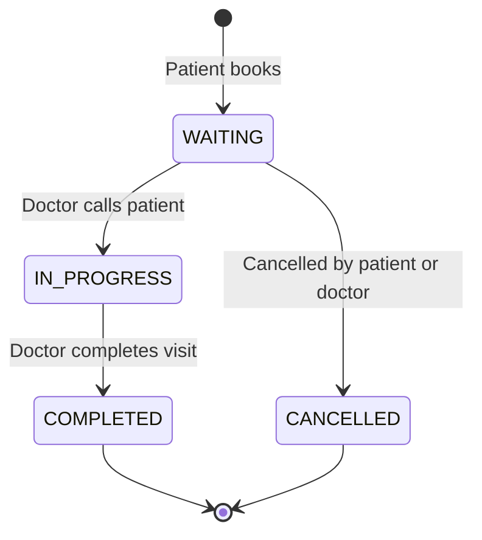
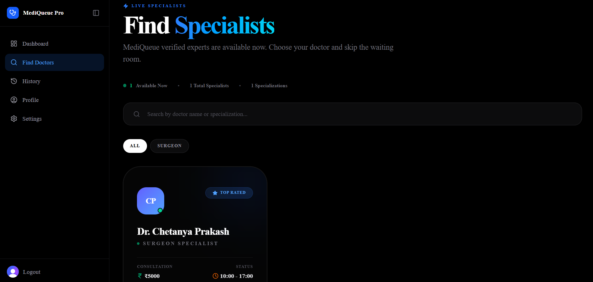
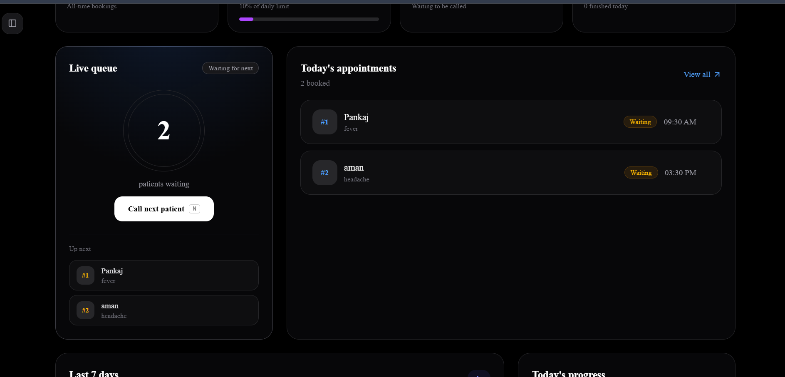
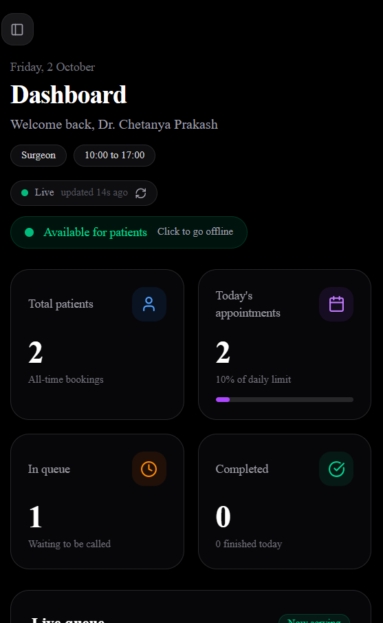
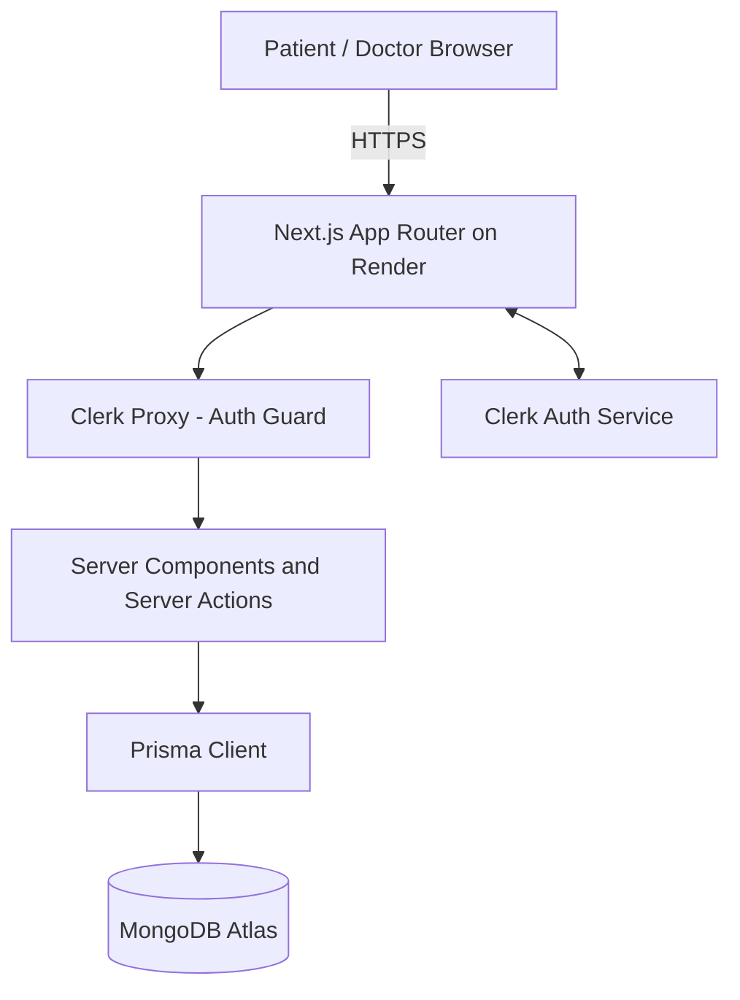
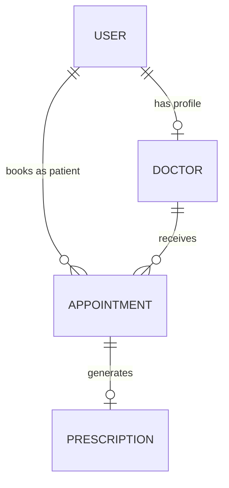

<div align="center">

# 🏥 MediQueue Pro

**A modern hospital / clinic queue and appointment management system**

Patients book appointments, get a live token number and track their place in the queue.
Doctors run a real-time queue, control their availability and write digital prescriptions.

### 🌐 [Live Demo → mediqueue-pro.onrender.com](https://mediqueue-pro.onrender.com)

> ⏳ Hosted on Render's free tier. If the site has been idle, the **first load can take 30–50 seconds** while the server wakes up. After that it is fast.


[](https://mediqueue-pro.onrender.com)
[](https://nextjs.org/)
[](https://react.dev/)
[](https://www.typescriptlang.org/)
[](https://www.prisma.io/)
[](https://www.mongodb.com/atlas)
[](https://clerk.com/)
[](https://tailwindcss.com/)

</div>

---

## 📑 Table of Contents

- [The Problem](#-the-problem)
- [How It Works](#-how-it-works)
- [Features](#-features)
- [Screenshots](#-screenshots)
- [Try It Yourself](#-try-it-yourself)
- [Tech Stack](#-tech-stack)
- [Architecture](#-architecture)
- [Project Structure](#-project-structure)
- [Data Models](#-data-models)
- [Getting Started](#-getting-started)
- [Environment Variables](#-environment-variables)
- [Available Scripts](#-available-scripts)
- [Deployment (Render)](#-deployment-render)
- [Troubleshooting](#-troubleshooting)
- [Roadmap](#-roadmap)
- [Contributing](#-contributing)
- [License](#-license)

---

## 🎯 The Problem

In most clinics, patients arrive early, sit in crowded waiting rooms and have no idea when their turn will come. Doctors have no clear view of how many patients are waiting, and paper prescriptions get lost.

**MediQueue Pro** fixes this by giving every patient a digital token and a live queue position, and giving every doctor a single dashboard to manage the day.

---

## 🔄 How It Works



### Appointment lifecycle



---

## ✨ Features

### 👤 For Patients
- 🔎 **Find doctors** by specialization, availability and consultation fees
- 📅 **Book appointments** and instantly receive a **token number**
- 📍 **Track queue status** as the doctor moves through the day
- 🕘 **Appointment history** with the ability to cancel upcoming bookings
- 📋 **View digital prescriptions** (diagnosis, medicines, notes) after a visit
- ⚙️ Profile and settings management

### 🩺 For Doctors
- 📊 **Live dashboard** with today's date, specialization and working-hours chips
- 🟢 **Availability toggle** with a live pulsing indicator
- 🔄 **Auto-refresh every 20 seconds** (only while the tab is visible) with a toast notification when a new patient books
- 🎯 **Live queue card** that highlights the patient currently being served
- ⚡ **"Up next" list** with inline hover actions: call now ▶ or remove ✕ (both with confirmation dialogs)
- ⌨️ **Keyboard shortcuts** for a fast workflow (see below)
- 📈 **Stat cards** with a daily patient limit progress bar
- 📉 **Last 7 days chart** and **today's progress donut chart**
- 📋 **Digital prescriptions** tied 1:1 to each appointment

### 🔧 General
- 🔐 **Secure authentication** with Clerk (OTP / sessions, route protection through the proxy layer)
- 👥 **Role-based dashboards** for `PATIENT`, `DOCTOR` and `ADMIN`
- 📱 **Fully responsive**: icon-rail sidebar on desktop, top bar with slide-in drawer on mobile
- 🌑 **Dark theme UI** with smooth Framer Motion transitions and hover glow effects
- ⏳ **Loading states** on every form action (spinner + disabled button)

### ⌨️ Doctor Keyboard Shortcuts

| Key | Action |
|---|---|
| `N` | Call the next patient |
| `C` | Mark the current appointment as complete |

---

## 📸 Screenshots

### 🏠 Landing Page

<div align="center">


</div>

### 👤 Patient Experience

<div align="center">

| Patient Dashboard | Find Doctors |
|:---:|:---:|
|  |  |

**Book Appointment**


</div>

### 🩺 Doctor Experience

<div align="center">

| Doctor Dashboard | Live Queue (Up Next) |
|:---:|:---:|
|  |  |

**Appointment Detail and Digital Prescription**


</div>

### 📱 Mobile Responsive

<div align="center">



</div>

---

## 🧪 Try It Yourself

You do not need any setup to test the app. Just open the [live demo](https://mediqueue-pro.onrender.com).

**To see the full flow, use two browsers (or one normal + one incognito window):**

1. **Browser A, doctor:** Sign up → choose **Doctor** → complete onboarding (specialization, fees, hours).
2. **Browser B, patient:** Sign up with a different email → choose **Patient** → complete onboarding.
3. As the patient, go to **Find Doctors** → pick the doctor you just created → **Book** an appointment.
4. Switch to the doctor window. Within ~20 seconds the dashboard refreshes and shows a toast for the new patient. You can also press refresh.
5. Press `N` to call the patient, then `C` to complete the visit.
6. Back as the patient, open **History** to see the completed appointment.

---

## 🧱 Tech Stack

| Layer | Technology |
|---|---|
| Framework | [Next.js 16](https://nextjs.org/) (App Router, Server Components, Server Actions) + React 19 |
| Language | TypeScript |
| Auth | [Clerk](https://clerk.com/) |
| Database | MongoDB Atlas via [Prisma ORM](https://www.prisma.io/) |
| Styling | Tailwind CSS v4 (CSS-based `@theme`), shadcn/ui, `tailwind-merge`, `tw-animate-css` |
| Animation | Framer Motion |
| Icons | Lucide React |
| Notifications | Sonner |
| Theming | next-themes |
| Hosting | [Render](https://render.com/) (web service) + MongoDB Atlas (database) |

---

## 🏗 Architecture



**Key design decisions**

- **Single full-stack app.** There is no separate backend or REST API. Server Actions (`src/actions/*`) handle every read and write, so there is only one deployment and no CORS to manage.
- **Auth at the edge of the app.** `src/proxy.ts` (the Next.js 16 replacement for `middleware.ts`) protects dashboard routes using Clerk.
- **Server-rendered dashboards.** Dashboard pages are dynamic (`ƒ`) server components, so data is always fresh and queries run close to the database.
- **Light "live" feel without WebSockets.** A small client component re-fetches server data every 20 seconds while the tab is visible and shows a toast on new bookings.

---

## 📂 Project Structure

```
mediqueue-pro/
├── prisma/
│   ├── schema.prisma            # User, Doctor, Appointment, Prescription models
│   └── seed.js                  # Optional seed data
├── screenshots/                 # README images
├── src/
│   ├── actions/                 # Server actions (appointment, doctor, user, prescription, dashboard)
│   ├── app/
│   │   ├── dashboard/
│   │   │   ├── page.tsx         # Role selection ("Identify Yourself")
│   │   │   ├── doctor/          # Dashboard, appointments, profile, settings, onboarding
│   │   │   │   └── _components/ # SubmitButton, Hotkeys, LiveRefresh, DoctorSidebar
│   │   │   └── patient/         # Dashboard, find-doctors, book, history, profile, settings, onboarding
│   │   │       └── _components/ # PatientSidebar
│   │   ├── globals.css          # Tailwind v4 theme + global font/size scaling
│   │   ├── layout.tsx           # Root layout, Clerk provider, Toaster, viewport
│   │   └── page.tsx             # Landing page
│   ├── components/
│   │   ├── ui/                  # shadcn/ui components
│   │   ├── theme-provider.tsx
│   │   └── theme-toggle.tsx
│   ├── lib/                     # Prisma client, utilities
│   └── proxy.ts                 # Clerk route protection
└── package.json
```

---

## 🗄️ Data Models

| Model | Purpose |
|---|---|
| **User** | Clerk-linked account with a `role` (`PATIENT` / `DOCTOR` / `ADMIN`) |
| **Doctor** | Specialization, fees, availability, working hours and max patients per day |
| **Appointment** | Links a patient and a doctor, with a token number and a status |
| **Prescription** | Diagnosis, medicines and notes, tied to exactly one appointment |



---

## 🚀 Getting Started

### Prerequisites

- **Node.js 20.9+**
- A **MongoDB** database ([MongoDB Atlas](https://www.mongodb.com/atlas) free tier works)
- A **[Clerk](https://clerk.com/)** account for authentication keys

### 1. Clone the repository

```bash
git clone https://github.com/chetanyapr-sys/mediqueue-pro.git
cd mediqueue-pro
```

### 2. Install dependencies

```bash
npm install
```

### 3. Configure environment variables

Create a `.env` file in the project root (see [Environment Variables](#-environment-variables)):

```env
DATABASE_URL="mongodb+srv://<user>:<password>@<cluster>.mongodb.net/mediqueue?retryWrites=true&w=majority"
NEXT_PUBLIC_CLERK_PUBLISHABLE_KEY="pk_test_..."
CLERK_SECRET_KEY="sk_test_..."
```

> ⚠️ Never commit `.env`. It is already excluded by `.gitignore`.

### 4. Generate the Prisma client and push the schema

```bash
npx prisma generate
npx prisma db push
```

Optionally seed the database:

```bash
node prisma/seed.js
```

### 5. Start the dev server

```bash
npm run dev
```

Open [http://localhost:3000](http://localhost:3000).

---

## 🔑 Environment Variables

| Variable | Required | Description |
|---|:---:|---|
| `DATABASE_URL` | ✅ | MongoDB connection string. The database name after the `/` must match the one your DB user has access to. |
| `NEXT_PUBLIC_CLERK_PUBLISHABLE_KEY` | ✅ | Clerk publishable key (public, baked into the client bundle at build time). |
| `CLERK_SECRET_KEY` | ✅ | Clerk secret key (server only, never expose). |
| `NODE_VERSION` | Render only | Set to `22` on Render so the build uses a compatible Node version. |

---

## 📜 Available Scripts

| Command | Description |
|---|---|
| `npm run dev` | Start the development server |
| `npm run build` | Create a production build |
| `npm run start` | Start the production server |
| `npm run lint` | Run ESLint |

---

## ☁️ Deployment (Render)

The live site runs on **Render** (web service) with **MongoDB Atlas** as the database.

1. Push the repository to GitHub.
2. On Render: **New + → Web Service** → connect the repo.
3. Use these settings:

   | Field | Value |
   |---|---|
   | Runtime | Node |
   | Branch | `main` |
   | Build Command | `npm install --include=dev && npx prisma generate && npx prisma db push && npm run build` |
   | Start Command | `npm start` |
   | Instance Type | Free |

4. Add the environment variables (`DATABASE_URL`, `NEXT_PUBLIC_CLERK_PUBLISHABLE_KEY`, `CLERK_SECRET_KEY`, `NODE_VERSION=22`).
   Add them **before** the first build, because `NEXT_PUBLIC_*` values are baked in at build time.
5. In **MongoDB Atlas → Network Access**, allow `0.0.0.0/0` (Render does not have fixed IPs).
6. Click **Create Web Service**. After the first deploy, every `git push` to `main` redeploys automatically.

**Good to know**

- 🛌 Free instances sleep after inactivity, so the first request can take 30–50 seconds.
- 🔐 Clerk **production** keys (`pk_live_`) require your own custom domain. On a `onrender.com` URL, use Clerk **development** keys (`pk_test_`).
- 👤 Use a dedicated MongoDB user per project with `readWrite` access to only that project's database.

---

## 🩹 Troubleshooting

| Problem | Likely cause and fix |
|---|---|
| Build fails with a Prisma error | Make sure the build command runs `npx prisma generate` (the generated client is git-ignored). |
| Build fails on missing Tailwind / TypeScript | Use `npm install --include=dev` so devDependencies are installed. |
| `Authentication failed` for MongoDB | Wrong user or password in `DATABASE_URL`. Avoid special characters in the password. |
| `Field patient is required to return data, got null` | Orphan appointments whose patient record was deleted. Remove those documents from the `Appointment` collection. |
| Can't connect to MongoDB from Render | Add `0.0.0.0/0` in Atlas Network Access. |
| Clerk login errors on the live site | Check that you are using development keys on an `onrender.com` domain. |
| Site takes ~40s to load | Render free-tier cold start. Normal after inactivity. |

---

## 🛣 Roadmap

- [ ] Real-time queue updates with WebSockets / Server-Sent Events
- [ ] SMS / email notifications when a patient's turn is near
- [ ] Admin panel for managing doctors and hospital-wide analytics
- [ ] Payment integration for consultation fees
- [ ] Multi-clinic / multi-branch support
- [ ] Polish and redesign of the remaining doctor and patient sub-pages

---

## 🤝 Contributing

Contributions, issues and feature requests are welcome.

1. Fork the repository
2. Create your feature branch (`git checkout -b feature/amazing-feature`)
3. Commit your changes (`git commit -m "Add some amazing feature"`)
4. Push to the branch (`git push origin feature/amazing-feature`)
5. Open a Pull Request

---

## 📄 License

This project is currently unlicensed. Add a license (for example MIT) if you plan to open-source it.

---

<div align="center">

Built with ❤️ by [@chetanyapr-sys](https://github.com/chetanyapr-sys)

⭐ If you found this project useful, consider giving it a star.

</div>